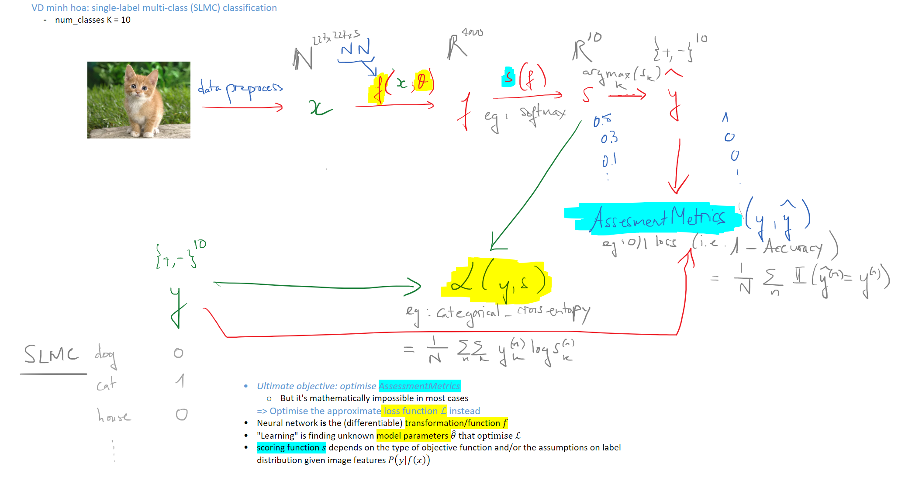
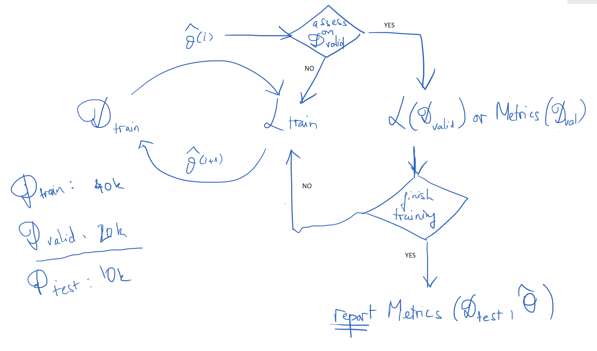

_best view in not-Chrome browsers (Chrome just doesn't like math rendered in Jupyter Notebook)_

Training sessions for new members at DSLab. Pre-requisite for subsequent sessions in Topic models and (supervised) Deep neural networks. 

Intended learning objectives: understand data analysis and modelling pipeline; fundamentals of machine learning: regression and classification, model formalisation by graphical models, (Bayesian) inference/learning, batch/stochastic gradient descent, (non)-linear classification with neural networks, latent variable models, and overview of approximate posterior inference.

#  Fundamentals of Data Analytics/Statistics/ML

## DA pipeline

Question A $\rightarrow$ Experimental design $\rightarrow$ Data
acquistion $\rightarrow$ Data pre-process/ETL $\rightarrow$ Modelling
$\rightarrow$ Assessment/Evaluation/Validation $\rightarrow$ Interpretation $\rightarrow$ (possible) Question A'

## Modelling pipeline
Motivation examples: http://www.r2d3.us/visual-intro-to-machine-learning-part-1/

Pipeline: illustrate with (parametric) modelling for single-label multi-class (SLMC) classification problem

Notes on math notations:
- Math is an efficient and universally understood language. Don't be afraid, embrace it. 
- Don't forget to explain the math in natural language though.

## Recap: sampling, inference, hypothesis testing

(Turn out teaching/studying statistics _properly_ at university level has not been  appreciated enough: _too much "HOW", so little on "WHY"_)

## (Extra) From statistical hypothesis testing to regression

## GLOSSARY 

_of Synonyms or Strongly related terms_

NOTE: All terms are in singular form (of the words). Any _plural word_ indicate the elements/members of the term in concern.

Term | Common annotation(s)
--- | --- | ---
estimation, prediction, inference | quantity of concern with the "hat", e.g. $\hat{y}$, $\hat{\theta}$, $\text{Pr}\left(y\left|x,\hat{\theta}\right.\right)$
loss function, cost function, objective function | $J\left(\cdot\right)$ , $L\left(\cdot\right)$
learning model, training model, parameter estimation, backward pass |
evaluating model, forward pass | 
score function, (inverse) link function | $f\left(\cdot\right)$ , $s\left(\cdot\right)$ , $g\left(\cdot\right)$ if link function
neuron, unit | 
independent variable, explanatory variable | $x$ , or $X$ in statistical literature 
dependent variable, response variable, target | $y$ , or $Y$ in statistical literature
hidden variable, latent variable, _hidden unit**s**_ | $z$
observed variable(s), observed data | $x$, and $y$ if supervised learning

# ML/DL Intro

[cs231n](); [Coursera (Andrew Ng)](); [PMRL (Bishop, 2006)]()

## Prediction in the form of Regression or Classification
(Return to modelling pipeline figure above)

## Linear classification

- visualise statistical relationship between variables by graphical models
- other contents extracted from https://github.com/hoamle/multiLabel/blob/master/tutorial_log.ipynb

### Score functions i.e. inverse Link functions

Aspiring Deep Learning (DL) self-learners often ask "when should I use Sigmoid (as in the score function)" or "where to use Hinge loss". The answer actually comes from one of the most fundamental material in statistcal modelling: ** Generalised Linear Models **(GLM).

- Pre-requisites
- GLM Recipes
- Case-study: binary & categorical classification

## (Extra) Behind a successful Algorithm is a bedazzle Model
or "Behind a jaw-dropping implementation is the bewilder theory"

*(This post is about machine learning algorithms/probabilistic models)*

Algorithms | generalised Algos / underlying Models
--- | --- 
line fitting by least-squares | Linear regression (on Gaussian variables)
k-mean clustering | Expectation-Maximisation, Gaussian mixture models
recommendation by matrix factorisation | Probabilistic matrix factorisation

## Learning model parameters: frequentist and Bayesian inference

Walk-through standard problem of predicting the outcomes of a coin-toss (or a dice-roll) https://github.com/hoamle/PRML/blob/master/Keynotes.ipynb
- maximum likelihood estimation
- posterior inference
- conjugacy

###  Exact and approximate inference
- Normal equation $\hat{\theta}=\left(X^{T}X\right)^{-1}X^{T}y$ and Gradient descent
- Conjugacy (recall)
- Expectation - Maximisation
- Variational inference
- (Extra) Hessian-matrix, 2nd-order methods

### (Extra) Goodness-of-fit tests, f-divergence, and approximate by VI
Motivation: evaluate degree of similarity between 2 distributions.
- distance measure: f-divergence (e.g. KL, $\chi_{n}$)
- See why Goodness-of-fit test statistics follow $\chi_{2}$-distribution 
- VI by maximising ELBO (KL)
- VI by minimising CUBO ($\chi_{2}$)

## The Stochastic and the Deterministic nodes
Current approach to marry PGM (Bayesian models) and DL (supervised DNN)
- Pre-requisites: knew to formalise model by graphical models
- Link to VAE/Amortised inference 

(Extra)
- Link to (deep) generative model 
- Case-studies in generative image modelling

### (Extra) Amortised inference: marry PGM and DL
[Kingma; Redenze (2014)]()

Vanilla VI: find (variational density's) stationary points analytically

"Amortised inference": find stationary points approximately by GD
- need an unbiased, low variant estimate of gradients: SGVI 
- properties: jointly estimate model and variational parameters with SGVI (hence armotised)

Other approaches:
- find stationary points approximately by variants of FW? (Likely not armotised though)

# FAQ

### Q: Can we use arbitrary activation function as score function?
A: No. A score function needs to "match" the distribution of response variable $y$. See [Link functions]()

### Q: "We are from yet-another-AI tech-firm/start-up and looking for collaboration. Can you do this put-in-the-blank problem(s)?"
A: First thing first, let be no __miscommunication__. Academics and Industry generally speak on different language, even though they are referring to a common problem. The tech-firms/start-ups in question should understand that Academics tend to use the terms for the *slightly-generalised* version of your problem(s) at discussion. Nevertheless, they are still talking about your problem(s), discussing the edges and caveats, but might be seen as "too theoretical" from the Industry perspective at some point. Also, let be clear about __how__ you want to collaborate. _Likewise_, academics should refrain from being overly abstract, and/or over-abuse technical terminology.
